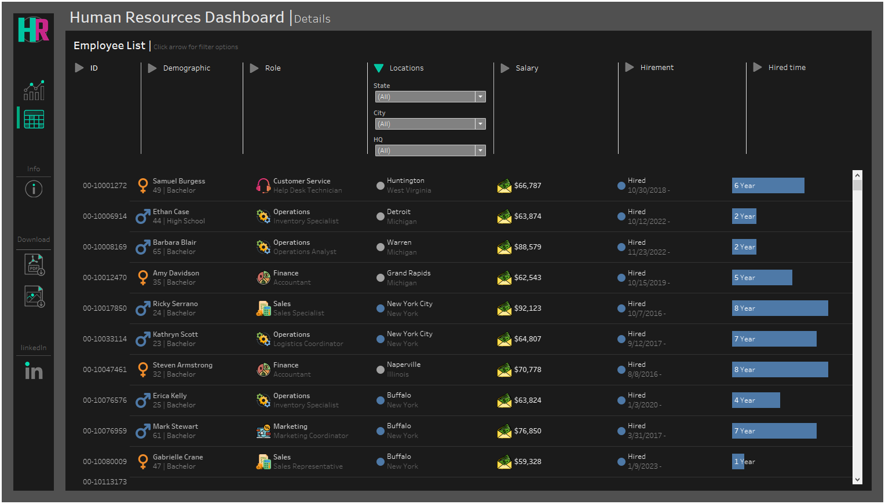

# Human Resources Dashboard in Tableau

## Overview
This Tableau dashboard provides insights into employee demographics, department distribution, performance ratings, salary distribution, and tenure. It's an interactive tool designed for HR managers to make data-driven decisions regarding workforce management.

### Features
- **Employee Demographics**: View gender distribution, age groups, and education levels.
- **Department Analysis**: Understand the distribution of employees across departments.
- **Performance Metrics**: Compare employee performance across different education levels.
- **Salary Insights**: Analyze salary distribution by gender, department, and age group.
- **Geographic Distribution**: Visualize employee locations on a map.

### Data Preparation
- **Dataset**: `HumanResources.csv`
- **Fields**: Includes personal details (name, gender, age), job information (department, title, hire date), education, salary, and location.
- **Data Cleaning**:
  - Calculated age from birthdate.
  - Created a "Full Name" field by concatenating first and last names.
  - Classified employees as "Hired" or "Terminated" based on termination date.

### Visualizations
1. **Overview Dashboard**:
   - Line and area charts for active vs. terminated employees over time.
   - Bar chart showing employee count by department.
   - Pie chart for gender distribution.
   - Education and performance correlation.

2. **Detailed Employee List Dashboard**:
   - Interactive list of employees with demographic, job role, and salary details.
   - Filter by location, hire date, and department.

### Interactive Features
- **Global Filters**: Apply filters across the dashboard (gender, location, employment status).
- **Clickable Visualizations**: Dynamic interactions for filtering data through chart clicks.
- **Hover Details**: Tooltip details for in-depth information on data points.

### Challenges and Solutions
- **Age Calculation**: Used DATEDIFF function to dynamically calculate employee age.
- **Performance Ratings as Text**: Assigned a numerical scale for performance ratings to enable trend analysis.
- **Combined Name Field**: Concatenated First Name and Last Name for simplified display.

### Getting Started
1. **Download the Tableau Workbook**:
   - Download the `.twbx` file to explore the dashboard in Tableau.
2. **Dataset**:
   - Use the provided `HumanResources.csv` dataset if available, or replace it with similar data.
3. **Customizing Filters**:
   - Modify global filters to focus on specific demographics, locations, or performance metrics.

### Screenshots
Here are some screenshots of the dashboard:

#### Overview

#### Detailed Employee List

## Conclusion
The Human Resources Dashboard in Tableau provides a comprehensive view of workforce metrics, enabling HR teams to make informed, data-driven decisions. With interactive filters and visualizations, it offers flexibility to explore various HR insights efficiently.
